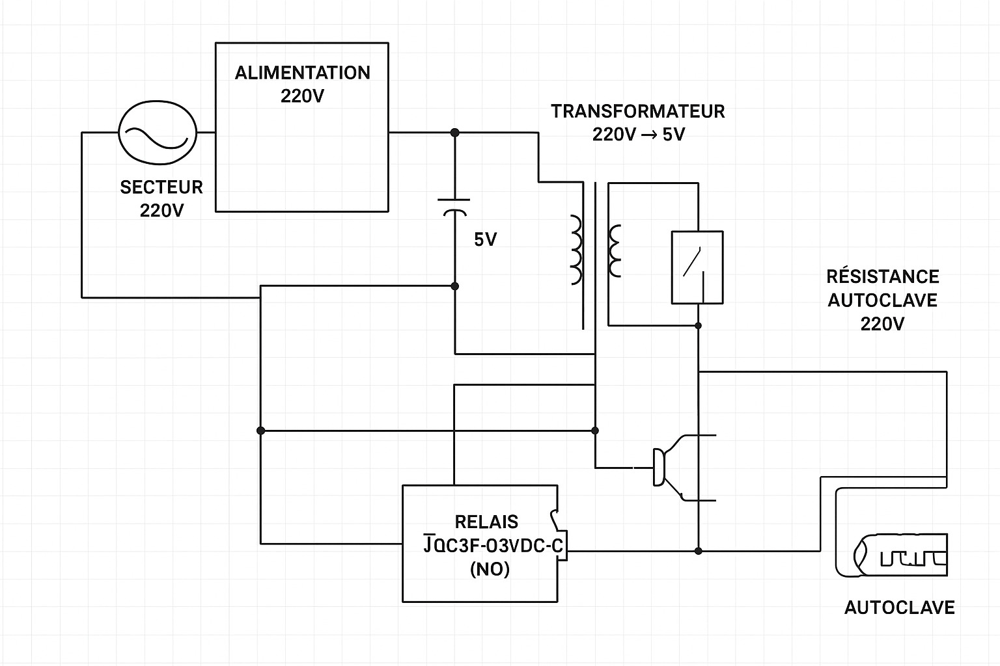
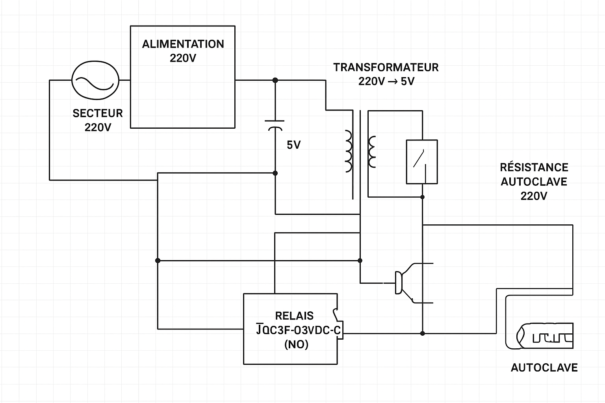
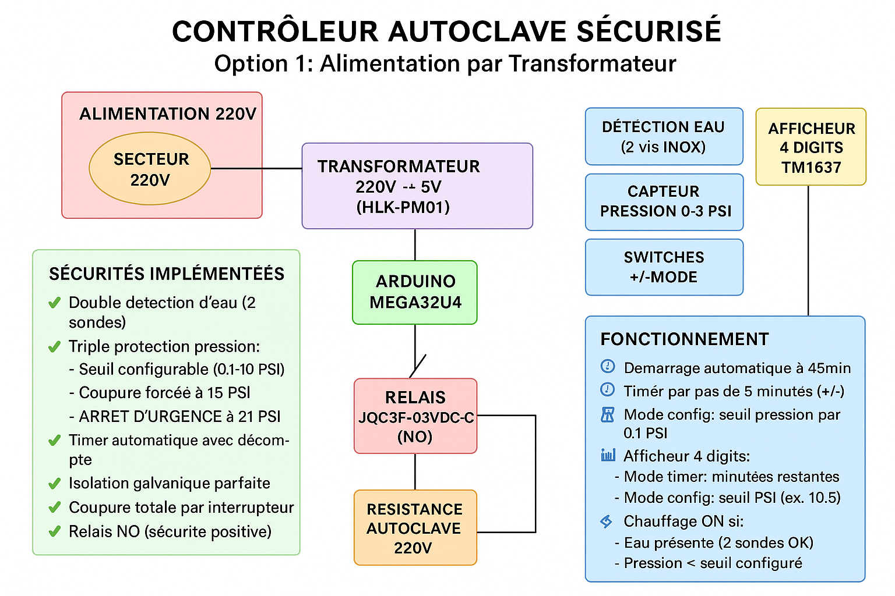

# Schéma de Câblage - Contrôleur Autoclave Sécurisé

### Illustrations du Schéma (dossier `schemas`)






## ⚠️ SÉCURITÉ CRITIQUE ⚠️

**ATTENTION: Ce système contrôle une résistance 220V dans un autoclave sous pression. Une erreur de câblage peut être MORTELLE. Faites vérifier par un électricien qualifié.**

## Composants Principaux

- **Mega32U4** (Arduino compatible)
- **DS3231** (Horloge temps réel)
- **Afficheur 4 digits TM1637**
- **Capteur pression 0-30PSI** (0.5-4.5V analogique)
- **Relais JQC3F-03VDC-C** (bobine 3V, contacts 250V/10A)
- **Interrupteur 220V** (marche/arrêt général)
- **3 micro-switches** (+ / - / Mode)
- **2 vis inox** (détection d'eau)
- **Condensateurs 104 (100nF)**

## Schéma de Câblage

### Alimentation et Sécurité 220V (Option 1 - Transformateur)

```
SECTEUR 220V ──┬── INTERRUPTEUR GÉNÉRAL ──┬── TRANSFORMATEUR 220V→5V ── Arduino + circuits
               │                          │   (Isolation galvanique parfaite)
               │                          │
               └─────────── NEUTRE ───────┴── NEUTRE vers résistance
                            │
                         RELAIS ────────── PHASE vers résistance
                      (contacts NO)
```

### Connections Arduino Mega32U4 (VERSION ACTUELLE)

```
Mega32U4                     Composant
========                     =========
+5V ────────────────────────── VCC Afficheur, Capteurs
GND ────────────────────────── GND commun tous composants

Pin 2 ──────────────────────── CLK Afficheur TM1637
Pin 3 ──────────────────────── DIO Afficheur TM1637
Pin 9 ──────────────────────── Signal relais (module pré-équipé)
Pin 10 ─────────────────────── LED témoin
Pin 11 ─────────────────────── Switch INC + (avec résistance pull-up)
Pin 12 ─────────────────────── Switch DEC - (avec résistance pull-up)
Pin A0 ─────────────────────── Sondes détection eau (diviseur résistif)
Pin A5 ─────────────────────── Signal capteur pression (0.5V-4.5V)
```

**Note:** DS3231 non utilisé dans la version actuelle du code.

### Détail Circuit de Sécurité Eau (NOUVELLE VERSION)

```
     +5V
      │
   Vis INOX #1 ────────────── Pin A0 (Mega32U4)
      │                              │
    EAU (conductrice)              │
      │                              │
   Vis INOX #2 ──── 100kΩ ───────┴── GND


**Principe de fonctionnement:**
- **Avec eau** (conductrice): Pin A0 lit ~5V (HIGH = 1023)
- **Sans eau** (circuit ouvert): Pin A0 lit ~0V via pull-down 100kΩ (LOW = 0)
- **Seuil détection**: WATER_THRESHOLD = 300 (dans le code)

**Avantages:**
- Circuit simple (2 composants seulement)
- Sécurité fail-safe: panne = pas d'eau détectée = arrêt
- Faible consommation (50μA max)
```

### Circuit Capteur Pression

```
Capteur Pression (0-30PSI)
========================
Rouge (+5V) ──────────── +5V Mega32U4
Noir (GND) ───────────── GND Mega32U4
Jaune (Signal) ──────── Pin A0 Mega32U4
                        (0.5V-4.5V = 0-30PSI)
```

### Module Relais Pré-Équipé

```
MODULE RELAIS (avec transistor et résistances intégrées)
====================================================

CONNEXIONS MODULE:
VCC ──── +5V Mega32U4
GND ──── GND Mega32U4  
IN  ──── Pin 9 Mega32U4 (PIN_RELAY)

CONTACTS 220V (ISOLÉS):
NO (Normalement Ouvert) ──── PHASE 220V vers résistance
COM (Commun) ────────────── PHASE 220V secteur  
NC (Normalement Fermé) ──── Non utilisé

**Logique de commande:**
- IN = HIGH (5V): Relais OFF (chauffage arrêté)
- IN = LOW (0V):  Relais ON  (chauffage actif)
- LED intégrée sur module indique l'état

**Sécurités intégrées:**
- Transistor + résistance de base
- Diode de roue libre
- LED indicateur d'état
- Isolation galvanique 5V/220V
```

### Switches avec Pull-up Internes (VERSION ACTUELLE)

```
Pour chaque switch (INC Pin 11 / DEC Pin 12):

Pin Arduino ──── INPUT_PULLUP (résistance interne ~47kΩ vers +5V)
     │
   Switch ──── GND

**Logique:**
- Switch ouvert:  Pin lit HIGH (5V)
- Switch appuyé: Pin lit LOW  (0V)
- Code: digitalRead(PIN) == LOW détecte l'appui
- Anti-rebond: délai 200ms entre lectures

**Avantages:**
- Pas de composants externes requis
- Circuit simplifié (juste le switch + fil GND)
- Pull-up stable intégrée dans le microcontrôleur
```

### Interrupteur Principal 220V (SOLUTION TRANSFORMATEUR)

```
COUPURE TOTALE - Plus d'optocoupleur nécessaire!

220V ──── INTERRUPTEUR ──── TRANSFORMATEUR 220V/5V ──── Arduino
                            (Isolation galvanique intégrée)

Quand interrupteur OFF = Arduino éteint = Sécurité maximale
Quand interrupteur ON  = Arduino démarre automatiquement avec timer 45min
```

## Liste des Sécurités Implémentées

### 1. **Sécurité Eau (Double détection)**

- Deux sondes inox indépendantes
- Arrêt immédiat si pas d'eau
- Résistance ne peut démarrer sans eau

### 2. **Sécurité Pression (Triple niveau)**

- **Niveau 1**: Coupure configurable (5-20 PSI)
- **Niveau 2**: Coupure forcée à 15 PSI
- **Niveau 3**: ARRÊT D'URGENCE à 21 PSI

### 3. **Sécurité Timer**

- Arrêt automatique à 0 minute
- Impossible de démarrer avec timer négatif
- Timer max 999 minutes

### 4. **Sécurité Électrique**

- Relais NO (normalement ouvert)
- Fusible sur phase 220V (recommandé 16A)
- Isolation galvanique Arduino/220V

## Mode de Fonctionnement

### Démarrage Automatique (Option 1)

1. **Interrupteur ON** → Arduino alimenté, démarre automatiquement
2. **Timer = 45min** par défaut au boot
3. **Vérifications automatiques**:
   - Présence d'eau (2 sondes)
   - Pression < seuil configuré
   - Timer > 0
4. **Si OK** → Relais activé, chauffage ON
5. **Décompte automatique** toutes les minutes

### Contrôles Utilisateur

- **Switch +** : +5 minutes (max 999)
- **Switch -** : -5 minutes (min 0)
- **Switch Mode** : Bascule Timer ↔ Config Pression
- **En mode Config** : +/- ajuste le seuil de coupure (0.1-10.0 PSI) par pas de 0.1

### Arrêts de Sécurité

- **Manque d'eau** → Arrêt immédiat
- **Pression > seuil** → Arrêt immédiat  
- **Pression > 21 PSI** → ARRÊT D'URGENCE (affichage "8888" clignotant)
- **Timer = 0** → Arrêt automatique
- **Interrupteur OFF** → Coupure totale

## Recommandations Transformateur

### Alimentations Recommandées

1. **HLK-PM01** (220V → 5V, 3W, compact)
2. **Alimentation rail DIN** 220V → 12V + régulateur 7805
3. **Alimentation à découpage** Mean Well (plus robuste)

### Avantages de cette solution

- ✅ **Isolation galvanique parfaite** (norme CE)
- ✅ **Simplicité de câblage** (pas d'optocoupleur)
- ✅ **Sécurité maximale** (coupure totale)
- ✅ **Démarrage automatique** à chaque mise sous tension
- ✅ **Moins cher** qu'une solution optocoupleur

## Test de Validation

Avant utilisation, tester obligatoirement:

- [ ] Coupure sur manque d'eau
- [ ] Coupure sur surpression (simuler)
- [ ] Arrêt d'urgence à 21 PSI
- [ ] Fonctionnement interrupteur principal
- [ ] Décompte timer correct
- [ ] Affichage modes timer/config

**EN CAS DE DOUTE, NE PAS UTILISER. CONSULTER UN PROFESSIONNEL.**
