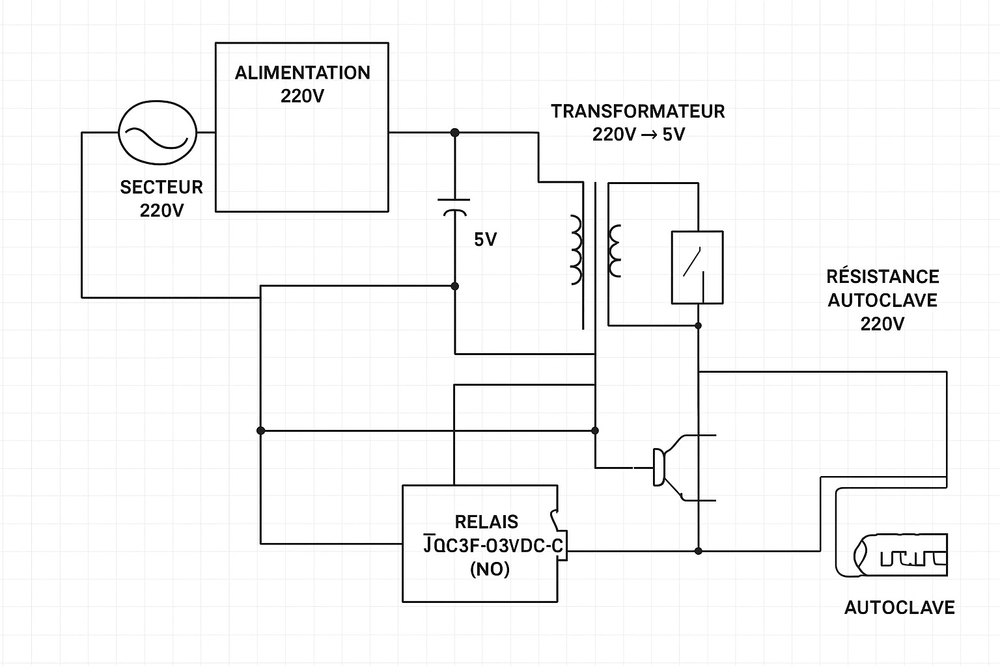

# Autoclave Controller - Experimental Project

**⚠️ EXPERIMENTAL PROJECT - FOR EDUCATIONAL PURPOSES ONLY ⚠️**

This is an experimental autoclave controller project using Arduino Mega32U4. This project is intended for educational and experimental purposes only. **Do not use in production environments without proper safety certifications and professional validation.**

## Project Overview

This project implements a safety-critical autoclave controller with the following features:

- **Water detection** using stainless steel probes
- **Pressure monitoring** with 0-30 PSI sensor
- **Timer control** with adjustable duration (1-99 minutes)
- **Safety shutdown** for water absence, overpressure, and timer expiration
- **Pressure regulation** with hysteresis control
- **4-digit TM1637 display** for status monitoring

## Schematic Diagrams

## ⚠️ CRITICAL SAFETY WARNING ⚠️

**WARNING: This system controls a 220V heating element in a pressurized autoclave. Wiring errors can be FATAL. Have the system verified by a qualified electrician before use.**

## Hardware Components

- **Mega32U4** (Arduino compatible microcontroller)
- **DS3231** (Real-time clock - currently not used in code)
- **4-digit TM1637 display**
- **Pressure sensor 0-30PSI** (0.5-4.5V analog output)
- **JQC3F-03VDC-C relay** (3V coil, 250V/10A contacts)
- **220V main switch** (power on/off)
- **3 micro-switches** (+ / - / Mode)
- **2 stainless steel screws** (water detection probes with O-rings for electrical isolation from autoclave chamber)
- **104 capacitors** (100nF)

## Safety Features

### 1. **Water Safety (Double detection)**
- Two independent stainless steel probes
- Immediate shutdown if no water detected
- Heating element cannot start without water

### 2. **Pressure Safety (Triple level)**
- **Level 1**: Configurable cutoff (5-20 PSI)
- **Level 2**: Forced cutoff at 15 PSI
- **Level 3**: EMERGENCY STOP at 21 PSI

### 3. **Timer Safety**
- Automatic shutdown at 0 minutes
- Cannot start with negative timer
- Maximum timer 999 minutes

### 4. **Electrical Safety**
- NO (Normally Open) relay
- Fuse on 220V phase (recommended 16A)
- Galvanic isolation Arduino/220V

## Operation Modes

### Automatic Startup (Option 1)
1. **Switch ON** → Arduino powers up, starts automatically
2. **Timer = 45min** default at boot
3. **Automatic checks**:
   - Water presence (2 probes)
   - Pressure < configured threshold
   - Timer > 0
4. **If OK** → Relay activated, heating ON
5. **Automatic countdown** every minute

### User Controls
- **Switch +** : +5 minutes (max 999)
- **Switch -** : -5 minutes (min 0)
- **Switch Mode** : Toggle Timer ↔ Pressure Config
- **In Config mode** : +/- adjusts cutoff threshold (0.1-10.0 PSI) in 0.1 steps

### Safety Shutdowns
- **No water** → Immediate stop
- **Pressure > threshold** → Immediate stop
- **Pressure > 21 PSI** → EMERGENCY STOP (flashing "8888" display)
- **Timer = 0** → Automatic stop
- **Main switch OFF** → Complete power cutoff

## Code Structure

The main program (`programme/programme.ino`) includes:

- **Pin definitions** for all components
- **Pressure thresholds** configurable for test/production modes
- **Water detection** with configurable threshold
- **Timer management** with countdown
- **Pressure regulation** with hysteresis
- **Display functions** for TM1637 4-digit display
- **Safety checks** in main loop

## Installation

### Prerequisites
1. **Arduino IDE** installed on your computer
2. **Arduino Mega32U4** (or compatible) connected via USB
3. **TM1637 library** installed in Arduino IDE

### TM1637 Library Installation
1. Open Arduino IDE
2. Go to **Tools → Manage Libraries...**
3. Search for **"TM1637"** by Avishay Orpaz
4. Click **Install**

### IDE Configuration
1. Connect your Arduino Mega32U4 via USB
2. In Arduino IDE:
   - **Tools → Board**: Select "Arduino Leonardo"
   - **Tools → Port**: Select the port corresponding to your board (e.g., COM3, /dev/ttyACM0)
   - **Tools → Processor**: "ATmega32U4"

### Uploading Code
1. Open `programme/programme.ino` in Arduino IDE
2. Verify all required libraries are installed
3. Click **"Verify"** (✓) to compile without errors
4. Click **"Upload"** (→) to send code to the board
5. Wait for **"Upload complete"** message

### Verification
- TM1637 display should show remaining time (e.g., "4500" for 45 minutes)
- LED on pin 10 should briefly light up at startup
- Open **Serial Monitor** (Tools → Serial Monitor) at 115200 baud to see debug messages

## Testing

Before use, mandatory tests:

- [ ] Shutdown on water absence
- [ ] Shutdown on overpressure (simulate)
- [ ] Emergency stop at 21 PSI
- [ ] Main switch functionality
- [ ] Correct timer countdown
- [ ] Display modes timer/config

**IF IN DOUBT, DO NOT USE. CONSULT A PROFESSIONAL.**

## Disclaimer

This project is provided "as is" without warranty of any kind. The authors are not responsible for any damage, injury, or loss resulting from the use of this project. This is an experimental/educational project only.

## License

This project is for educational purposes. Use at your own risk.

---

**Remember: This is just an experiment!**